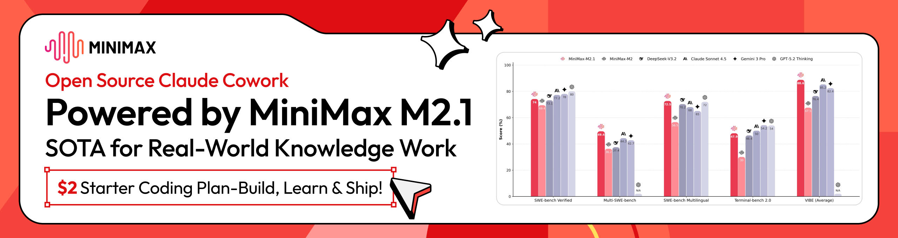

<div align="center">

# Open Claude Cowork

[](https://github.com/DevAgentForge/Claude-Cowork/releases)
[](https://github.com/DevAgentForge/Claude-Cowork/releases)

[英文](README.md)

</div>

## ❤️赞助商

[](https://platform.minimax.io/subscribe/coding-plan?code=5q2B2ljfdw&source=link)

MiniMax-M2.1 是一款开源的 SOTA（当前最先进）模型，在编程能力、数字环境操作以及处理长流程、多步骤任务方面表现出色。
通过 开源的 Claude Cowork 替代方案，M2.1 朝着我们“通用生产力 AI”的长期愿景迈出了坚实一步，让先进的 AI 能力真正触达每一个人。

[点击](https://platform.minimax.io/subscribe/coding-plan?code=5q2B2ljfdw&source=link)即可享受 MiniMax 编程计划专属 12% 折扣

---

## 关于

一个**桌面 AI 助手**，帮助你完成**编程、文件管理以及任何你能描述的任务**，  

强行兼容**Claude Code 完全相同的配置**，这意味着你可以使用任意兼容 Anthropic 的大模型来运行。

> 不只是一个 GUI。  
> 是真正的 AI 协作伙伴。  
> 无需学习 Claude Agent SDK，使用该软件创建任务并选择任务路径即可。

一个整理本地文件夹的例子：

[https://github.com/user-attachments/assets/694430fb-9d4b-452e-8429-d9c565082f43](https://github.com/user-attachments/assets/8ce58c8b-4024-4c01-82ee-f8d8ed6d4bba)

---

## ✨ 为什么选择 Claude Cowork？

Claude Code 很强大 — 但它**只能在终端中运行**。

这意味着：
- ❌ 复杂任务没有可视化反馈
- ❌ 难以追踪多个会话
- ❌ 查看工具输出很不方便

**Agent Cowork 解决了这些问题：**

- 🖥️ 作为**原生桌面应用**运行
- 🤖 成为你的 **AI 协作伙伴**，处理任何任务
- 🔁 复用你**现有的 `~/.claude/settings.json`**
- 🧠 与 Claude Code **100% 兼容**

如果 Claude Code 在你的机器上能用 —  
**Agent Cowork 也能用。**

---

## 🚀 快速开始

注意，使用前请先安装 Claude Code 并完成配置。

### 方式一：下载安装包


👉 [前往 Releases 下载](https://github.com/DevAgentForge/agent-cowork/releases)

---

### 方式二：从源码构建

#### 前置要求

- [Bun](https://bun.sh/) 或 Node.js 18+
- [Claude Code](https://docs.anthropic.com/en/docs/claude-code) 已安装并完成认证

```bash
# 克隆仓库
git clone https://github.com/DevAgentForge/agent-cowork.git
cd agent-cowork

# 安装依赖
bun install

# 开发模式运行
bun run dev

# 或构建生产版本
bun run dist:mac    # macOS
bun run dist:win    # Windows
bun run dist:linux  # Linux
```

---

## 🧠 核心能力

### 🤖 AI 协作伙伴 — 不只是 GUI

Agent Cowork 是你的 AI 协作伙伴，可以：

* **编写和编辑代码** — 支持任何编程语言
* **管理文件** — 创建、移动、整理
* **运行命令** — 构建、测试、部署
* **回答问题** — 关于你的代码库
* **做任何事** — 只要你能用自然语言描述

---

### 📂 会话管理

* 创建会话并指定**自定义工作目录**
* 恢复任何之前的对话
* 完整的本地会话历史（SQLite 存储）
* 安全删除和自动持久化

---

### 🎯 实时流式输出

* **逐字流式输出**
* 查看 Claude 的思考过程
* Markdown + 语法高亮代码渲染
* 工具调用可视化及状态指示

---

### 🔐 工具权限控制

* 敏感操作需要明确批准
* 按工具允许/拒绝
* 交互式决策面板
* 完全控制 Claude 能做什么

---

## 🔁 与 Claude Code 完全兼容

Agent Cowork **与 Claude Code 共享配置**。

直接复用：

```text
~/.claude/settings.json
```

这意味着：

* 相同的 API 密钥
* 相同的 Base URL
* 相同的模型
* 相同的行为

> 配置一次 Claude Code — 到处使用。

---

## 🧩 架构概览

| 层级 | 技术 |
|------|------|
| 框架 | Electron 39 |
| 前端 | React 19, Tailwind CSS 4 |
| 状态管理 | Zustand |
| 数据库 | better-sqlite3 (WAL 模式) |
| AI | @anthropic-ai/claude-agent-sdk |
| 构建 | Vite, electron-builder |

---

## 🛠 开发

```bash
# 启动开发服务器（热重载）
bun run dev

# 类型检查
bun run build

# 代码检查
bun run lint
```


---

## 🗺 路线图

计划中的功能：

* GUI 配置接口与 KEY
* 🚧 更多功能即将推出

---

## 🤝 贡献

欢迎提交 PR。

1. Fork 本仓库
2. 创建你的功能分支
3. 提交你的更改
4. 发起 Pull Request

---

## ⭐ 最后

如果你曾经想要：

* 一个常驻桌面的 AI 协作伙伴
* Claude 工作过程的可视化反馈
* 跨项目的便捷会话管理

这个项目就是为你准备的。

👉 **如果对你有帮助，请给个 Star。**

---

## 许可证

MIT
